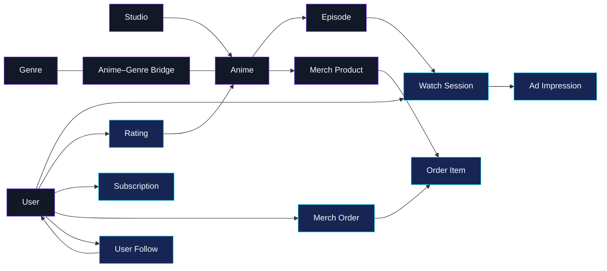

<div align="center">


# QueryForge

### Governed AI analytics, from natural language to auditable SQL

Turn business questions into safe, traceable SQLite queries—with a semantic layer,
policy enforcement, bounded recovery, and production-friendly delivery interfaces.

[简体中文](README.zh-CN.md) · [Quick start](#quick-start) · [Architecture](#how-it-works) · [Documentation](#documentation)


</div>

---

QueryForge is a local-first AI data analytics platform built around one principle:
**generated SQL should be governed like application code, not trusted like prose**.

It combines natural-language-to-SQL with semantic contracts, AST-level security,
read-only execution, multi-candidate selection, repair budgets, and complete run
artifacts. The result is a reference implementation for building AI data systems
that are useful, inspectable, and difficult to misuse.

> QueryForge currently targets SQLite and controlled environments. It is a
> portfolio-grade reference architecture, not a multi-tenant analytics service.

## Product Tour

<div align="center">
  
  <sub>Workspace overview — live semantic health, governed metrics, and anime-platform activity.</sub>
</div>

<br>

<div align="center">
  
  
  <br>
  <sub>Semantic Studio &nbsp;·&nbsp; Governed analysis with auditable SQL and Trust Trace</sub>
</div>

## Why QueryForge?

Most NL2SQL demos stop after a model emits a query. QueryForge covers the full
delivery loop:

| Need | QueryForge approach |
| --- | --- |
| Trust the generated SQL | Parse with SQLGlot and enforce a named policy before execution |
| Keep business meaning consistent | Define metrics, dimensions, grain, and join paths in YAML |
| Recover from imperfect output | Reflect, repair, and retry within explicit budgets |
| Handle harder questions | Use bounded schema discovery and parallel SQL candidates |
| Trace what happened | Persist run state, policy decisions, quality evidence, and artifacts |
| Integrate with other tools | Expose CLI, REST/SSE, MCP, gateway, JSON, charts, and HTML reports |
| Start from raw data | Build governed SQLite assets from CSV, Parquet, and paginated JSON APIs |

## Highlights

- **Defense in depth** — candidates are checked before execution and revalidated
  at the database boundary.
- **Semantic contracts** — YAML models describe business metrics, entities,
  relationships, cardinality, ownership, SLA, sensitivity, and quality rules.
- **Adaptive workflow** — simple questions stay fast; complex questions can
  activate a bounded tool loop and concurrent candidate selection.
- **Read-only by default** — normal analysis opens SQLite databases in read-only
  mode and rejects write or administrative SQL.
- **Multiple delivery surfaces** — use the same application service through the
  CLI, REST/SSE, MCP, or a webhook gateway.
- **Reproducible evaluation** — the repository includes offline acceptance checks
  and a 120-case, three-domain NL2SQL gold set.

## Quick Start

### 1. Install

Requirements: **Python 3.11 or 3.12** and SQLite.

```bash
python3.11 -m venv .venv
source .venv/bin/activate
python -m pip install --upgrade pip
python -m pip install -e .
cp .env.example .env
```

### 2. Configure a model

Set one provider in `.env`. OpenAI-compatible, Claude, Gemini, Qwen, DeepSeek,
and GLM configurations are included.

```dotenv
LLM_PROVIDER=openai
OPENAI_API_KEY=your-api-key
OPENAI_MODEL=gpt-4.1-mini
```

Provider defaults and environment-variable mappings live in [`models.yml`](models.yml).

### 3. Run the bundled example

```bash
queryforge --prepare-sample-data

queryforge \
  --database sample_data/anime_streaming/anime_streaming.sqlite \
  --question "Which anime generated the most watch hours?"
```

Try a multi-hop semantic query:

```bash
queryforge \
  --database sample_data/anime_streaming/anime_streaming.sqlite \
  --semantic-model sample_data/anime_streaming/semantic_model.yml \
  --sql-policy sample_data/anime_streaming/sql_policy.yml \
  --question "Compare watch completion and merchandise GMV by anime genre"
```

### Explore QueryForge Studio

The repository now includes a complete visual workspace for onboarding data,
reviewing the required semantic layer, asking governed questions, inspecting SQL
and Trust Trace evidence, and auditing run history.

```bash
# Terminal 1: QueryForge API
python -m pip install -e ".[api]"
queryforge --serve-api

# Terminal 2: QueryForge Studio
make web-install
make web-dev
```

Open <http://localhost:3000>. If the Python API is offline, the interface
automatically uses a deterministic demo response so every screen remains
explorable. See the [Studio guide](docs/studio.md).

## How It Works

<div align="center">
  
</div>

The public lifecycle stays intentionally small:

```text
analysis → candidate → execution → completion → delivery
```

Role-specific agents operate inside those stages. A deterministic router chooses
the path; the model does not control the security boundary.

## SQL Governance

Every generated query passes through an auditable pipeline:

```text
SQL candidate
  → SQLite AST parse
  → single read-only statement
  → table and column scope
  → dangerous-function checks
  → recursive CTE and cross-join checks
  → table, join, and LIMIT budgets
  → governed preview
  → execution-boundary revalidation
```

A policy can be as small as:

```yaml
version: 1
name: anime_streaming
allowed_tables:
  - fact_watch_session
  - dim_anime
require_limit: true
max_limit: 500
max_tables: 2
max_joins: 1
allow_cross_join: false
```

Policy denials return a structured `SQL_SECURITY_ERROR` before SQLite execution.

## Semantic Layer

QueryForge's YAML semantic models give generated SQL business context that raw
schemas cannot provide:

```yaml
metrics:
  - name: watch_hours
    description: Total valid viewing time in hours.
    entity: watch_session
    aggregation: sum
    expression: SUM(fact_watch_session.watch_seconds) / 3600.0
    default_filters:
      - fact_watch_session.is_valid = 1
    owner: audience-analytics
    sensitivity: internal
```

Models can declare entities, dimensions, metrics, grain, relationships, join
paths, fan-out constraints, operational metadata, and physical quality rules.
QueryForge requires a validated model by default; it auto-discovers a model beside
the database and rejects schema-only analysis unless the caller explicitly selects
the diagnostic escape hatch.

Build or incrementally refresh one:

```bash
python scripts/build_semantic_model.py \
  --database warehouse.sqlite \
  --output warehouse.semantic.yml \
  --owner data-platform
```

The generated report separates high-confidence physical evidence from definitions
that need business review. See [Semantic layer authoring](docs/semantic_authoring.md)
and [Semantic contracts](docs/semantic_contracts.md).

The repository also includes a Monday-morning
[semantic drift workflow](.github/workflows/semantic-weekly.yml) that checks schema,
metrics, relationships, Join Paths, and data-quality contracts against a reviewed
baseline.

### Anime platform showcase

The bundled dataset is purpose-built for QueryForge and fully synthetic: **370,762
rows**, **15 tables**, **30 declared relationships**, **7 governed Join Paths**, and
**11 business metrics** across content, engagement, subscriptions, advertising,
community, and merchandise.



See the [dataset contract](sample_data/anime_streaming/README.md), inspect the
[semantic model](sample_data/anime_streaming/semantic_model.yml), or regenerate
the database and optional CSV exports with
`python sample/generate_anime_streaming.py`.

## Common Workflows

### Preview a plan without executing SQL

```bash
queryforge \
  --plan-mode \
  --question "Compare monthly watch hours by subscription tier"
```

### Enable the complex execution profile

```bash
queryforge \
  --complexity-mode complex \
  --parallel-candidates 3 \
  --question "Explain completion-rate changes by genre, device, and membership tier"
```

### Stream progress or create a report

```bash
queryforge --stream --question "List the top ten anime by watch hours"
queryforge --report --question "Build a report for monthly engagement by genre"
```

### Build a governed data asset

```bash
python -m pip install -e ".[assets]"

python scripts/scaffold_data_asset.py \
  --source events.csv \
  --output events.assets.yml \
  --owner engagement-analytics

# Review the semantic draft and set semantic_model.reviewed: true.
python scripts/build_data_assets.py \
  --config sample_data/data_assets/assets.yml \
  --publish-database .queryforge/demo/analytics.sqlite
```

Every uploaded asset must carry entity semantics. Data and semantics publish
atomically, so a failed metric, relationship, grain, or quality contract rolls the
whole upload back.

### Start the REST API

```bash
python -m pip install -e ".[api]"
queryforge --serve-api --api-host 127.0.0.1 --api-port 8000
```

```bash
curl -X POST http://127.0.0.1:8000/ask \
  -H 'content-type: application/json' \
  -d '{
    "question": "List the ten anime with the highest completion rate",
    "database": "sample_data/anime_streaming/anime_streaming.sqlite"
  }'
```

### Start the MCP server

```bash
python -m pip install -e ".[mcp]"
python -m queryforge.interfaces.mcp.server --transport stdio
```

## Interfaces

| Surface | Entry point | Best for |
| --- | --- | --- |
| Studio | `make web-dev` | Visual onboarding, semantic authoring, and governed analysis |
| CLI | `queryforge --question "..."` | Local exploration and engineering workflows |
| REST | `POST /ask` and `POST /plan` | Application integration |
| SSE | `POST /ask/stream` | Progress-aware clients |
| MCP | `queryforge.interfaces.mcp.server` | IDEs and MCP-compatible assistants |
| Gateway | `POST /gateway/webhook` | Stable user/channel session adapters |
| Artifacts | JSON, Vega-Lite, SVG, HTML | Review, sharing, and audit |

## Project Structure

```text
queryforge/
├── cli.py             # Installed CLI implementation
├── application/       # Transport-neutral service facade and resources
├── core/              # Configuration, schemas, and observability
├── data_assets/       # Ingestion, quality, lineage, and publication
├── domain/            # SQL policy, semantics, contracts, and skills
├── infrastructure/    # SQLite, model providers, storage, and tools
├── interfaces/        # CLI-adjacent API, MCP, and gateway adapters
├── orchestration/     # Router, role agents, lifecycle, and state
└── workflow/          # NL2SQL nodes, selection, repair, and reporting

evaluation/gold/       # Multi-domain NL2SQL evaluation cases
sample_data/           # Ready-to-run SQLite datasets and semantic models
web/                   # QueryForge Studio and hosted persistence adapters
scripts/               # Build, benchmark, evaluation, and acceptance tools
tests/                 # Unit, integration, boundary, and acceptance tests
docs/                  # Architecture and feature documentation
.github/               # CI, semantic drift audit, and contribution templates
```

Dependencies flow inward from interfaces and application code toward domain,
infrastructure, and core contracts.

## Quality and Evaluation

Run the complete offline quality gate:

```bash
python scripts/run_acceptance.py --full
```

Or run the test suite directly:

```bash
python -m unittest discover -s tests -q
```

Live model evaluation reports execution success, semantic equivalence, policy
precision/recall, latency, estimated cost, and candidate-selection uplift:

```bash
python scripts/evaluate_sql.py \
  --cases evaluation/gold/nl2sql_multidomain.jsonl \
  --model-provider openai \
  --output .queryforge/evaluations/openai.json
```

CI runs the offline acceptance gate on Python 3.11 and 3.12.

## Documentation

| Topic | Guide |
| --- | --- |
| Architecture | [Agent team architecture](docs/agent_team_architecture.md) |
| Configuration | [Configuration reference](docs/configuration.md) |
| Studio | [Visual workspace and semantic onboarding](docs/studio.md) |
| REST API | [API reference](docs/api_reference.md) |
| MCP | [MCP server](docs/mcp_server.md) |
| Semantic layer | [Semantic contracts](docs/semantic_contracts.md) |
| Semantic authoring | [Build, review, and require semantic models](docs/semantic_authoring.md) |
| Data assets | [Data asset builds](docs/data_assets.md) |
| Evaluation | [NL2SQL evaluation](docs/nl2sql_evaluation.md) |
| Reports | [Report artifacts](docs/report_artifact.md) |
| Subject scoping | [Subject tree](docs/subject_tree.md) |
| GitHub release | [First-publish checklist](docs/github_release.md) |
| Documentation index | [All guides](docs/README.md) |

## Contributing and Security

- [Contributing guide](CONTRIBUTING.md)
- [Security policy](SECURITY.md)
- [Code of conduct](CODE_OF_CONDUCT.md)
- [Changelog](CHANGELOG.md)

The source tree is ready for GitHub review and CI. The repository owner still needs
to select and add a `LICENSE` before public release; no license has been assumed on
their behalf.

## Scope and Security

QueryForge's guarantees apply to its configured SQLite execution boundary. The
project does **not** currently include:

- production authentication, authorization, tenant isolation, or rate limiting;
- durable distributed workflow recovery or token-level cancellation;
- PostgreSQL, MySQL, warehouse, lakehouse, or streaming-system adapters;
- provider-normalized billing or a trained-model lifecycle.

Keep REST and MCP transports inside a controlled environment. Do not commit
provider secrets, generated run state, or local databases containing sensitive data.

## Roadmap

- Database adapters beyond SQLite
- First-class authentication and tenant policy boundaries
- Durable workflow execution and cancellation
- Warehouse-catalog integrations
- Provider-independent usage and cost accounting

Contributions and design discussions are welcome after the repository license is selected.
