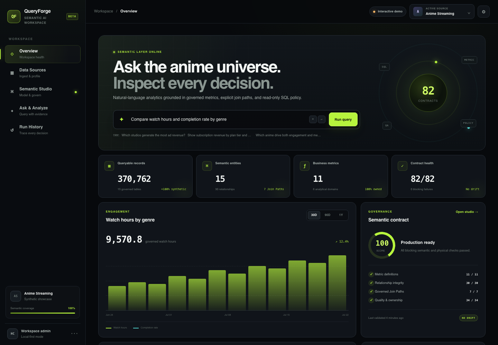
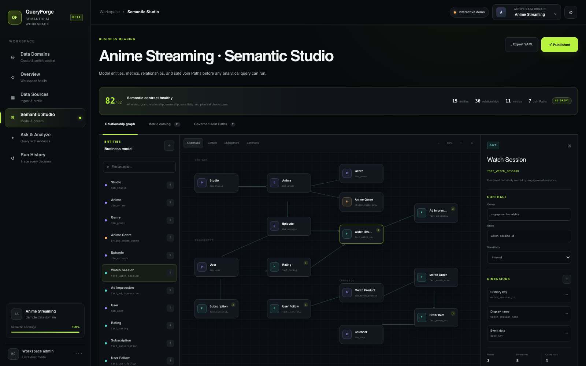
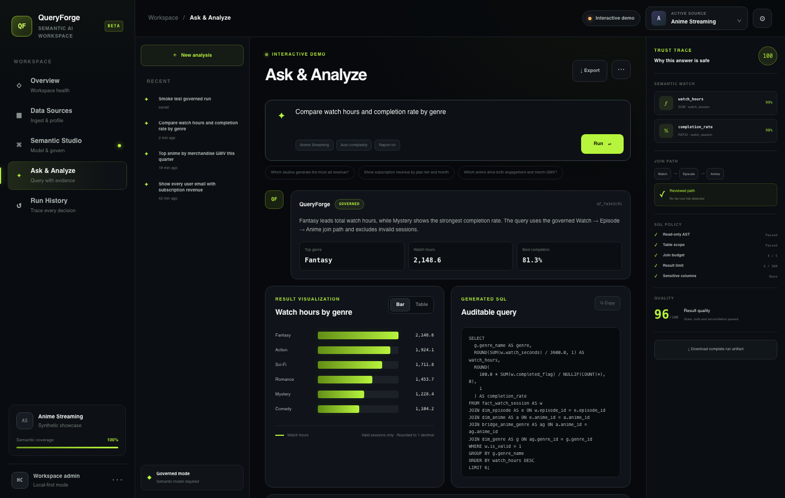
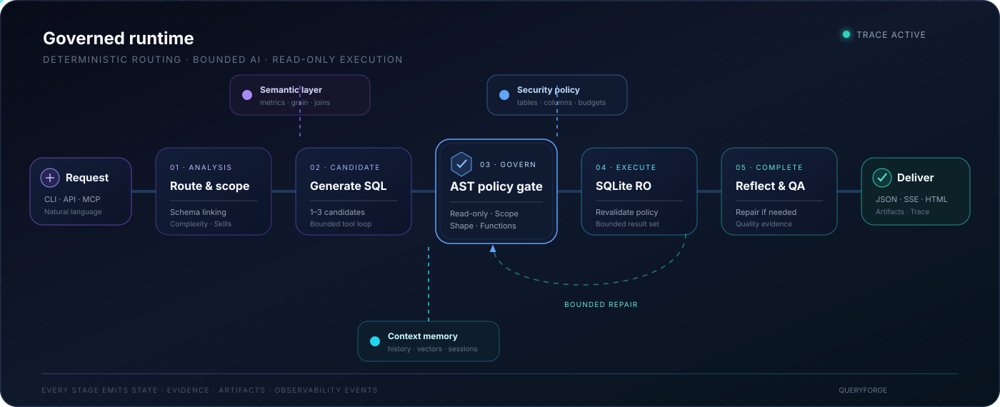
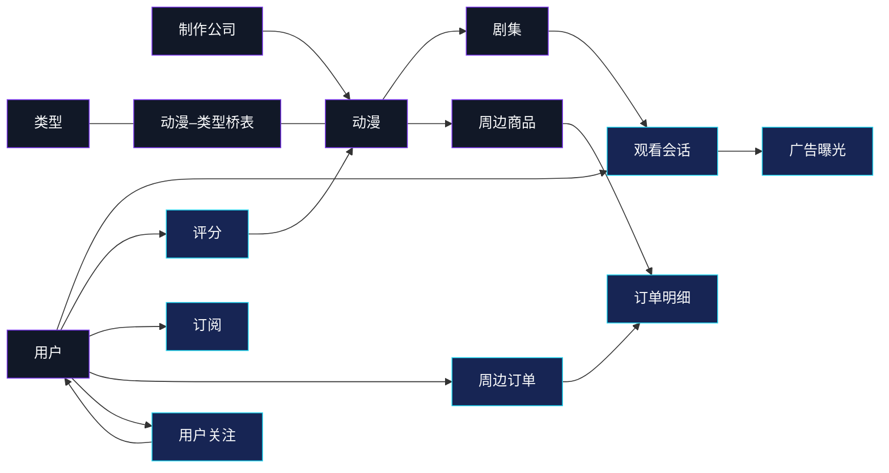

<div align="center">



# QueryForge

### 从自然语言到可审计 SQL 的受治理 AI 数据分析平台

把业务问题转成安全、可追踪的 SQLite 查询，并提供语义层、策略治理、
有界修复和面向工程集成的多种交付接口。

[English](README.md) · [快速开始](#快速开始) · [系统架构](#系统架构) · [项目文档](#项目文档)


</div>

---

QueryForge 是一个本地优先的 AI 数据分析平台，它围绕一个核心原则设计：
**模型生成的 SQL 应该像应用代码一样被治理，而不是像自然语言一样被直接信任。**

项目将 NL2SQL、语义契约、AST 级安全策略、只读执行、多候选选择、有界修复和完整
运行产物串成一个闭环，适合作为可信 AI 数据系统的参考实现。

> QueryForge 当前专注 SQLite 和受控环境，是面向作品展示与架构验证的参考项目，
> 不是可直接公网部署的多租户分析服务。

## 产品界面

<div align="center">
  
  <sub>工作台总览——实时展示语义健康度、受治理指标和动漫平台业务动态。</sub>
</div>

<br>

<div align="center">
  
  
  <br>
  <sub>语义建模工作台 &nbsp;·&nbsp; 带可审计 SQL 和 Trust Trace 的受治理分析</sub>
</div>

## 为什么是 QueryForge？

大多数 NL2SQL Demo 在模型输出查询后就结束了，QueryForge 关注的是完整交付链路：

| 真实问题 | QueryForge 的处理方式 |
| --- | --- |
| 如何信任生成的 SQL | 使用 SQLGlot 解析 AST，执行前应用具名安全策略 |
| 如何保证业务口径一致 | 用 YAML 定义指标、维度、粒度和 Join Path |
| 模型输出不完美怎么办 | 在明确预算内反思、修复和重试 |
| 复杂问题如何处理 | 启用有界 Schema 探索和并发 SQL 候选 |
| 如何追踪运行过程 | 保存状态、策略决策、质量证据和交付产物 |
| 如何接入其他应用 | 提供 CLI、REST/SSE、MCP、Gateway、图表和 HTML 报告 |
| 原始数据如何进入分析 | 从 CSV、Parquet 和分页 JSON API 构建受治理 SQLite 数据资产 |

## 核心亮点

- **纵深防御**：SQL 在执行前接受治理，并在数据库执行边界再次校验。
- **语义契约**：YAML 模型描述业务指标、实体、关系、基数、owner、SLA、
  敏感级别和质量规则。
- **自适应工作流**：简单问题保持轻量；复杂问题可启用 Tool Loop 和并发候选选择。
- **默认只读**：普通分析以只读方式打开 SQLite，并拒绝写操作和管理类 SQL。
- **统一多端交付**：同一应用服务可通过 CLI、REST/SSE、MCP 和 Webhook Gateway 使用。
- **可复现评测**：仓库内置离线验收流程，以及覆盖三个业务域的 120 条 NL2SQL 金标集。

## 快速开始

### 1. 安装

环境要求：**Python 3.11 或 3.12**、SQLite。

```bash
python3.11 -m venv .venv
source .venv/bin/activate
python -m pip install --upgrade pip
python -m pip install -e .
cp .env.example .env
```

### 2. 配置模型

在 `.env` 中选择一个 Provider。项目已包含 OpenAI-compatible、Claude、Gemini、
Qwen、DeepSeek 和 GLM 的配置。

```dotenv
LLM_PROVIDER=qwen
QWEN_API_KEY=your-api-key
QWEN_MODEL=qwen-plus
```

Provider 默认值和环境变量映射见 [`models.yml`](models.yml)。

### 3. 运行内置示例

```bash
queryforge --prepare-sample-data

queryforge \
  --database sample_data/anime_streaming/anime_streaming.sqlite \
  --question "Which anime generated the most watch hours?"
```

体验动漫平台数据集上的多跳语义查询：

```bash
queryforge \
  --database sample_data/anime_streaming/anime_streaming.sqlite \
  --semantic-model sample_data/anime_streaming/semantic_model.yml \
  --sql-policy sample_data/anime_streaming/sql_policy.yml \
  --question "Compare watch completion and merchandise GMV by anime genre"
```

### 体验 QueryForge Studio

仓库现在包含一个完整的可视化工作台：可以接入数据、评审强制语义层、提出受治理的
自然语言问题、检查 SQL 与 Trust Trace 证据，并审计历史运行。

```bash
# 终端 1：QueryForge API
python -m pip install -e ".[api]"
queryforge --serve-api

# 终端 2：QueryForge Studio
make web-install
make web-dev
```

打开 <http://localhost:3000>。Python API 离线时，界面会自动使用确定性的演示结果，
所有页面仍然可以完整体验。详见 [Studio 使用指南](docs/studio.md)。

## 系统架构

<div align="center">
  
</div>

对外生命周期保持精简：

```text
analysis → candidate → execution → completion → delivery
```

不同角色的 Agent 在这些阶段内部运行。确定性 Router 负责选择路径，模型不会控制安全边界。

## SQL 安全治理

每条模型生成的 SQL 都会经过可审计的处理链：

```text
SQL candidate
  → SQLite AST 解析
  → 单条只读语句
  → 表和列范围
  → 危险函数检查
  → 递归 CTE 与 Cross Join 检查
  → 表、Join 和 LIMIT 预算
  → 受治理预览
  → 执行边界二次校验
```

策略可以非常精简：

```yaml
version: 1
name: anime_streaming
allowed_tables:
  - fact_watch_session
  - dim_anime
require_limit: true
max_limit: 500
max_tables: 2
max_joins: 1
allow_cross_join: false
```

策略拒绝会在 SQLite 执行前返回结构化 `SQL_SECURITY_ERROR`。

## 业务语义层

QueryForge 使用 YAML 语义模型补充原始 Schema 无法表达的业务上下文：

```yaml
metrics:
  - name: watch_hours
    description: Total valid viewing time in hours.
    entity: watch_session
    aggregation: sum
    expression: SUM(fact_watch_session.watch_seconds) / 3600.0
    default_filters:
      - fact_watch_session.is_valid = 1
    owner: audience-analytics
    sensitivity: internal
```

模型可声明实体、维度、指标、粒度、关系、Join Path、fan-out 约束、运营元数据和
物理质量规则。QueryForge 现在默认强制使用经过校验的语义模型，并自动发现数据库旁边
的模型；除非显式启用诊断逃生口，否则不允许只依赖裸 Schema 查询。

创建或增量更新语义层：

```bash
python scripts/build_semantic_model.py \
  --database warehouse.sqlite \
  --output warehouse.semantic.yml \
  --owner data-platform
```

构建报告会区分高置信度物理证据和必须由业务确认的定义，详见
[语义层构建指南](docs/semantic_authoring.md)和[语义契约](docs/semantic_contracts.md)。

仓库还包含每周一早晨运行的
[语义漂移检查](.github/workflows/semantic-weekly.yml)，会基于审核后的基线检查
Schema、指标、关系、Join Path 和数据质量契约。

### 动漫平台数据集

内置样例是专为 QueryForge 构造的全合成数据：**370,762 行**、**15 张表**、
**30 条声明关系**、**7 条受治理 Join Path**、**11 个业务指标**，覆盖内容、
观看、订阅、广告、社区和动漫周边。



可阅读[数据集说明](sample_data/anime_streaming/README.md)和
[语义模型](sample_data/anime_streaming/semantic_model.yml)，或执行
`python sample/generate_anime_streaming.py` 确定性重建数据库及可选 CSV 导出。

## 常用工作流

### 只生成并检查计划，不执行 SQL

```bash
queryforge \
  --plan-mode \
  --question "Compare monthly watch hours by subscription tier"
```

### 启用复杂执行模式

```bash
queryforge \
  --complexity-mode complex \
  --parallel-candidates 3 \
  --question "Explain completion-rate changes by genre, device, and membership tier"
```

### 流式查看进度或生成报告

```bash
queryforge --stream --question "List the top ten anime by watch hours"
queryforge --report --question "Build a report for monthly engagement by genre"
```

### 构建受治理数据资产

```bash
python -m pip install -e ".[assets]"

python scripts/scaffold_data_asset.py \
  --source events.csv \
  --output events.assets.yml \
  --owner engagement-analytics

# 审核语义草案，并将 semantic_model.reviewed 设置为 true。
python scripts/build_data_assets.py \
  --config sample_data/data_assets/assets.yml \
  --publish-database .queryforge/demo/analytics.sqlite
```

每个上传资产都必须携带实体语义。数据和语义模型原子发布，指标、关系、粒度或质量
契约任一失败都会回滚整批上传。

### 启动 REST API

```bash
python -m pip install -e ".[api]"
queryforge --serve-api --api-host 127.0.0.1 --api-port 8000
```

```bash
curl -X POST http://127.0.0.1:8000/ask \
  -H 'content-type: application/json' \
  -d '{
    "question": "List the ten anime with the highest completion rate",
    "database": "sample_data/anime_streaming/anime_streaming.sqlite"
  }'
```

### 启动 MCP Server

```bash
python -m pip install -e ".[mcp]"
python -m queryforge.interfaces.mcp.server --transport stdio
```

## 接口与交付

| 方式 | 入口 | 适合场景 |
| --- | --- | --- |
| Studio | `make web-dev` | 可视化数据接入、语义编写与受治理分析 |
| CLI | `queryforge --question "..."` | 本地探索和工程工作流 |
| REST | `POST /ask`、`POST /plan` | 应用集成 |
| SSE | `POST /ask/stream` | 需要进度事件的客户端 |
| MCP | `queryforge.interfaces.mcp.server` | IDE 和 MCP 兼容助手 |
| Gateway | `POST /gateway/webhook` | 稳定的用户/渠道会话适配 |
| Artifact | JSON、Vega-Lite、SVG、HTML | 复核、分享和审计 |

## 项目结构

```text
queryforge/
├── cli.py             # 安装后的 CLI 实现
├── application/       # 与传输协议无关的服务门面和资源
├── core/              # 配置、共享 Schema 和可观测性
├── data_assets/       # 数据接入、质量、血缘和发布
├── domain/            # SQL 策略、语义层、契约和 Skills
├── infrastructure/    # SQLite、模型 Provider、存储和工具
├── interfaces/        # API、MCP 和 Gateway 适配器
├── orchestration/     # Router、角色 Agent、生命周期和状态
└── workflow/          # NL2SQL 节点、候选选择、修复和报告

evaluation/gold/       # 多业务域 NL2SQL 评测集
sample_data/           # 可直接运行的 SQLite 数据集和语义模型
web/                   # QueryForge Studio 与托管持久化适配器
scripts/               # 构建、基准、评测和验收工具
tests/                 # 单元、集成、边界和验收测试
docs/                  # 架构与功能文档
.github/               # CI、语义漂移审计和贡献模板
```

依赖从接口层和应用层向领域、基础设施与核心契约单向流动。

## 质量与评测

执行完整离线质量门禁：

```bash
python scripts/run_acceptance.py --full
```

也可以直接运行测试：

```bash
python -m unittest discover -s tests -q
```

在线模型评测覆盖执行成功率、语义等价率、策略 precision/recall、延迟、估算成本和
候选选择提升：

```bash
python scripts/evaluate_sql.py \
  --cases evaluation/gold/nl2sql_multidomain.jsonl \
  --model-provider qwen \
  --output .queryforge/evaluations/qwen.json
```

CI 会在 Python 3.11 和 3.12 上执行离线验收。

## 项目文档

| 主题 | 文档 |
| --- | --- |
| 系统架构 | [Agent Team 架构](docs/agent_team_architecture.md) |
| 配置 | [配置参考](docs/configuration.md) |
| Studio | [可视化工作台与语义数据接入](docs/studio.md) |
| REST API | [API 参考](docs/api_reference.md) |
| MCP | [MCP Server](docs/mcp_server.md) |
| 语义层 | [语义契约](docs/semantic_contracts.md) |
| 语义层构建 | [构建、评审与强制语义模型](docs/semantic_authoring.md) |
| 数据资产 | [数据资产构建](docs/data_assets.md) |
| 评测 | [NL2SQL 评测](docs/nl2sql_evaluation.md) |
| 报告 | [报告产物](docs/report_artifact.md) |
| 主题域裁剪 | [Subject Tree](docs/subject_tree.md) |
| GitHub 发布 | [首次发布清单](docs/github_release.md) |
| 文档索引 | [全部指南](docs/README.md) |

## 贡献与安全

- [贡献指南](CONTRIBUTING.md)
- [安全策略](SECURITY.md)
- [行为准则](CODE_OF_CONDUCT.md)
- [变更记录](CHANGELOG.md)

代码结构、CI 和协作模板已经具备 GitHub 发布条件。公开发布前仍需由仓库所有者选择并
添加 `LICENSE`；本次整理没有擅自替你作出许可证法律选择。

## 范围与安全边界

QueryForge 的安全保证适用于其配置后的 SQLite 执行边界。项目目前**不包含**：

- 生产级认证授权、多租户隔离和限流；
- 持久化分布式工作流恢复或 token 级取消；
- PostgreSQL、MySQL、数仓、湖仓和流处理系统适配器；
- 跨 Provider 统一计费，或训练模型的完整生命周期。

请将 REST 和 MCP 接口部署在受控环境中，不要提交 Provider 密钥、运行状态，
以及包含敏感数据的本地数据库。

## Roadmap

- SQLite 之外的数据库适配器
- 一等的认证能力和租户策略边界
- 持久化工作流执行与取消
- 数仓 Catalog 集成
- 跨 Provider 的用量与成本核算

选择 Repository License 后即可正式开放外部贡献和设计讨论。
